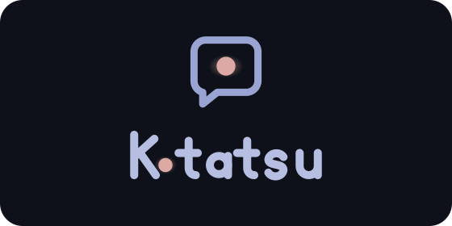
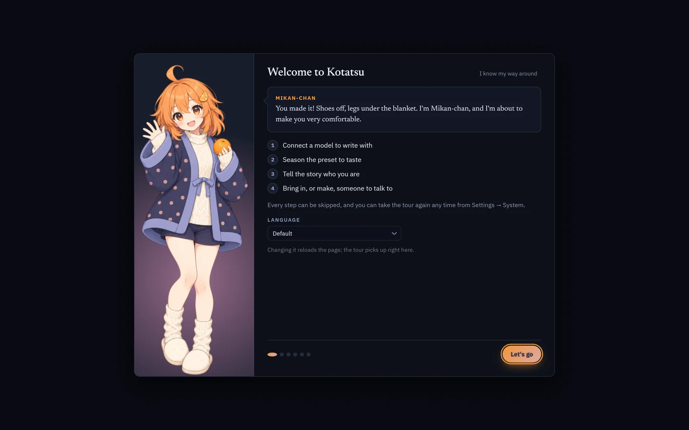
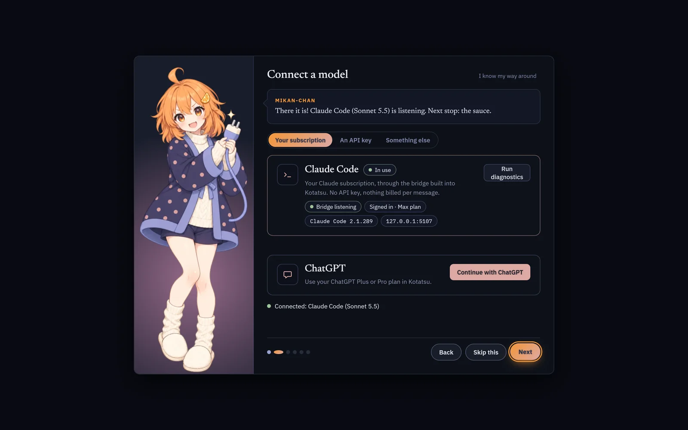
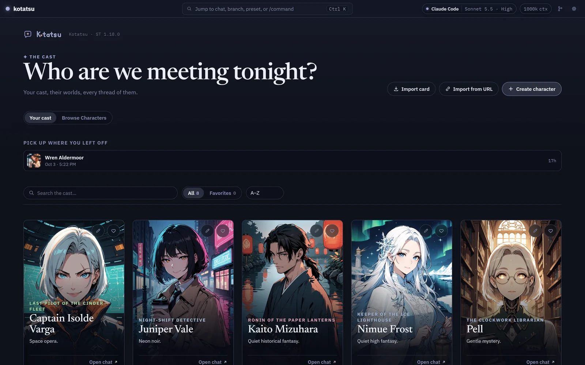
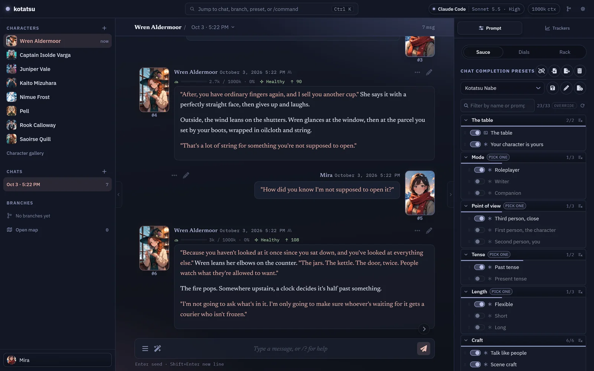
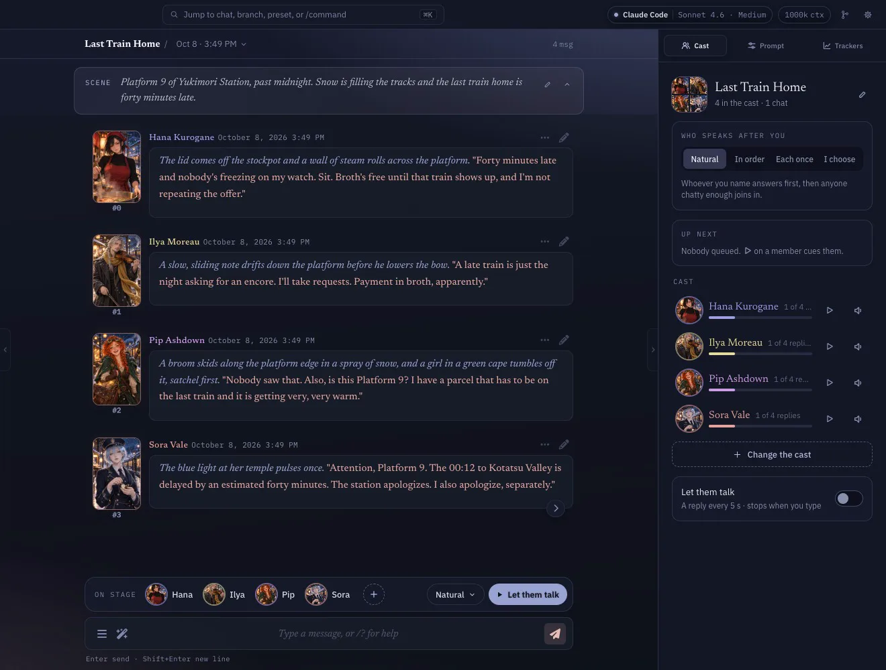

<p align="center">
  
</p>

<p align="center"><em>The warm table you don't want to leave.</em></p>

<p align="center"><strong>Kotatsu is SillyTavern for writing.</strong> It has the same characters, presets, extensions and data folder, behind a calm, fast interface, with a guide who sets it up alongside you.</p>

<p align="center"><a href="https://youtu.be/9l3QbwZjmks"><strong>Watch the 60-second trailer</strong></a></p>

| | |
|:---:|:---:|
|  |  |
| Mikan-chan walks you through setup | Use the subscription you already have |
|  |  |
| Your cast, on one shelf | A reader made for long stories |

---


> Oh, you found us! Get in, the kotatsu's warm. Everything below is the long version. The short version: it's cozy, and I'll show you around.
>
> — *Mikan-chan*

## What Kotatsu is

Kotatsu is a fork of [SillyTavern](https://github.com/SillyTavern/SillyTavern) (AGPL-3.0), the open-source front-end for writing stories and roleplay with AI models. You bring a model (Claude, ChatGPT, an API key, or something running locally), and Kotatsu gives you the page. That means characters to write with, a persona to write as, and presets that shape how the model writes back.

It's built around three promises:

1. **Warm from the first minute.** A guided setup, good defaults, and nothing you have to learn before you can start writing.
2. **Everything SillyTavern let you shape.** Presets, extensions, cards, themes and your data folder all carry over.
3. **Fast, and nothing in the way.** Long chats open quickly, streaming stays smooth, and the interface keeps out of the way of the prose.

**And it comes with you.** One scan of a QR code pairs your phone, at home on your Wi-Fi or anywhere on your tailnet with Tailscale. Your chats, characters and connections are the same ones you left on the computer. [On your phone](#on-your-phone) has the switch and the scan.

### What Kotatsu isn't

Kotatsu isn't trying to be a game engine. It has no dice, no inventory screens and no visual-novel stage. Those are great, and other front-ends do them well. Kotatsu spends every pixel and millisecond on the page you're writing and the preset shaping it.

> No dice, no inventory, no stage. Just you, a story, and a very good table.
>
> — *Mikan-chan*

## Warm from the first minute


> First time? Perfect. I'll walk you from hello to your first message. Skip anything you like; I'll only sulk a little.
>
> — *Mikan-chan*

On first launch, Mikan-chan walks you through five steps. Every one can be skipped, and so can the whole tour (*"I know my way around"*). You can replay it later from Settings.

1. **Connect.** If Claude Code is on your computer, Kotatsu finds it on its own, and the tour checks live that it is really talking. If it isn't, pick another way in. Whichever of these fits you:
   - **Your subscription**: Claude Code with your Claude plan, or your ChatGPT Plus or Pro plan (see [The ChatGPT bridge](#the-chatgpt-bridge)). No API key to manage.
   - **An API key**: Anthropic, OpenAI, Google AI Studio, DeepSeek, xAI or OpenRouter. Keys stay on your computer.
   - **Something else**: NanoGPT, Mistral, a local model, a custom endpoint or a saved connection, set up in the Connection tab.
2. **Sauce.** Pick a preset and season it. Not sure what a preset is? **What are these?** has Mikan-chan explain it at her chalkboard. Kotatsu Nabe is preselected: pick how you like to play (Roleplayer, Writer, Companion), and its tile carries a **mature content** switch, on by default. The other bundled presets (listed below) show their own options under *More seasoning*, and Kotatsu only shows the dials your connection actually honors. Some third-party presets bring their own scripts, and picking one asks you first whether to allow them.
3. **Persona.** Who you are in these stories. A name is enough.
4. **First card.** Import a file, import from a link, **Browse Characters**, build one from scratch, or say hi to Seraphina.
5. **Ready.** You're in the chat, and the first message is yours.

### New here? Four words you'll see

- **Card**: a character, meaning their personality, scenario and first message, saved as a PNG or JSON you can share.
- **Persona**: you. The name and description the story knows you by.
- **Preset**: the instructions that shape *how* the model writes: voice, pacing, length, what it's allowed to do.
- **Lorebook**: facts about a world that get pulled into the story only when they're relevant.

### What a fresh install comes with

- **Seraphina**, SillyTavern's classic first companion, with her lorebook.
- **Kotatsu Nabe** as the active preset: Kotatsu's own house preset, light and warm, written to let you lead.
- **Three more presets**, bundled with their authors' permission and credited below, plus SillyTavern's plain default.
- A **Claude** connection already selected, talking to Sonnet 5.5 through the built-in bridge, for when you set up Claude Code. Switch models from the menu in the top bar, or pick a different connection in the tour.
- **Blue Hour** as the default look, with **Sparkle** one click away.

### Bundled presets and credits

| Preset | Author | What it is |
|---|---|---|
| **Kotatsu Nabe** | Kotatsu | The default. Kotatsu's own sauce, with the mature content switch. |
| **Sola V2 · Ember** | [Pyrxpia](https://github.com/Pyrxpia/sola-hub) | Lightweight roleplay: Sola's core, with the extras left off. |
| **Sola V2 · Flame** | [Pyrxpia](https://github.com/Pyrxpia/sola-hub) | The full engine: story review, trackers and colored dialogue, the way its author plays. |
| **Nemo Vivarium** | [NemoVonNirgend](https://github.com/NemoVonNirgend/NemoEngine/tree/main/Vivarium) | A living world in a handful of deep blocks, by the author of Nemo Engine. |
| **Plain (Default)** | SillyTavern | SillyTavern's own default preset, unchanged. |

Pyrxpia gave permission to ship Ember and Flame, including the regex scripts embedded in them. NemoVonNirgend gave permission to ship Vivarium. The authors' presets are shipped as published; only the connection settings are pointed at Kotatsu's bridge. The preset dock shows a credit line for the active preset.

### Browse Characters

You can browse and import character cards from [Chub](https://chub.ai) without leaving Kotatsu. It's in the library's Browse view, in the tour's First card step, and on the empty library. Opening a card shows a preview sheet with the whole first message, every alternate greeting, the description, the creator's note and a few facts (token counts, lorebook entries). So you can read a card properly before you bring it home. The first time you open it, a line tells you Chub is an 18+ site and links to its terms, and it isn't shown again. Mature cards are behind an off-by-default switch, and their thumbnails stay blurred until you hover. Whether Chub serves mature cards depends on Chub's own rules for where you are, and Kotatsu tells you when it isn't getting any.

## Scenes: more than two at the table

<p align="center"></p>

A scene puts several characters in one chat. **New scene** in the library opens the studio: seat your cast (the numbers are the order they speak in when they take turns), name the scene, and set it in a line or two.

- **You choose who answers.** Write `@Hana and @Pip` and they answer in that order, or tap a face on the stage and pick **Speak now**.
- **Let them talk.** The cast carries the scene on its own, one reply after another, and the stage shows who is writing and who is next. Type, or press it again, to take the floor back.
- **A narrator for the world.** Seat a narrator and it voices the place, the weather and anyone outside the cast. It never speaks for your characters.
- **Every speaker wears their colour**, on the stage, in the Cast tab and in the transcript.

On disk a scene is an ordinary SillyTavern group chat, so stock SillyTavern still opens it. The [wiki](https://github.com/lumenastrum/kotatsu-public/wiki/Scenes) has the details.

## Everything SillyTavern let you shape


> Bring your presets, your cards, your extensions, your whole data folder. I already cleared a shelf.
>
> — *Mikan-chan*

**Presets, readable at last.** The prompt list is grouped into sections instead of one long wall, toggles say what they do, and "pick one" groups behave like radio buttons. Every reply keeps a **receipt**, the exact prompt that went to the model, so when something reads wrong you can see why. Real-world presets load byte-for-byte unchanged through the pipeline, and Kotatsu's test suite holds two community presets to that.

**Extensions.** Kotatsu freezes the extension surface in [`CONTRACT.md`](CONTRACT.md): 26 DOM IDs, 146 `getContext()` keys, 104 events, 15 core module paths and 8 `/api/extensions/*` routes. Additions are always allowed; removing or renaming anything on the list needs an explicit revision of that file. We also ran a stress test with 25 popular extensions loaded at once, plus three layout-takeover extensions one at a time. It produced zero JavaScript errors caused by Kotatsu, and it found where extensions and Kotatsu's layout disagreed. Fixed since:
- The top bar now sits at SillyTavern's own layer, so extension layers that expect to sit under it do.
- Wide popups size the way stock does, and the right rail steps aside for extension panels docked to the screen edge.
- Extensions that mount their own drawer in SillyTavern's top bar get a tab in the right rail.
- An extension that takes the chat out of Kotatsu's frame, or covers the page, is named in a notice with a **Disable and reload** button.

Still open: two extensions that dock panels into the same right margin can overlap each other. The stress test ran in Chromium only.

**Coming from SillyTavern?** Copy your `data/` folder in. Characters, chats, personas, presets and lorebooks carry over unchanged. Everything Kotatsu adds lives in dot-folders and can be rebuilt from your chat files, so the way back stays open too. The formats are pinned in [`docs/data-contract.md`](docs/data-contract.md).

1. Close Kotatsu.
2. Copy the contents of your SillyTavern `data/` folder into Kotatsu's `data/` folder (`Documents\Kotatsu\data` on a Windows install, or `data/` inside your clone when you run from source on macOS or Linux).
3. Start Kotatsu. Branches you made in SillyTavern are found and adopted on first open.

Copy your user data, and leave SillyTavern's code and `config.yaml` where they are. Kotatsu has its own.

**Make it look like yours.**
- **Themes are data.** A theme pack is a folder of colors, fonts, layout choices and art, with no code inside. Four ship in the box: Blue Hour, Sparkle, Natsumikan and Midnight Kissaten.
- **Message styles.** Card, flat, bubble, script, split bubbles, portrait, portrait column and broadcast, plus a reading-size setting that keeps lines a comfortable length on any screen.
- **One settings window,** with tabs and search, instead of a dozen drawers.

**Branches as a real tree.** Fork a chat at any message, jump between branches, rename without breaking links, and see the whole tree on a map (`Ctrl+Shift+B`).

## Fast, and nothing in the way


> Long chats, no waiting. Your mikan stays warm.
>
> — *Mikan-chan*

Kotatsu rebuilt the parts of SillyTavern that slow down as your stories grow: the chat renderer, streaming, and the prompt list. The server also serves a prebuilt front-end bundle instead of rebuilding it on every launch.

**And the part you feel rather than measure:**
- **A reader built for prose:** comfortable line lengths, paragraph rhythm, contrast that passes accessibility checks, and pink italics if you're wearing Sparkle.
- **A layout that spends the screen:** a left rail for your cast and chats, a right rail for the live preset, a chat header where the title is the chat switcher. Collapse the left rail with `Ctrl+\` and the right with `Ctrl+Shift+\`.
- **Connections that tell the truth:** the composer tells you *why* it can't send, and the top bar shows exactly which model and effort level you're on.
- **Calm motion,** with no icons made of emoji and nothing that jumps.

## On your phone

> Yes, I fit in your pocket too.
>
> — *Mikan-chan*

On a phone-sized screen the chat takes the whole screen and both rails become sheets you pull in from the edges. Reaching Kotatsu from your phone is a switch and a scan:

1. On the computer running Kotatsu, open **Settings → System → Phone** ("Use Kotatsu on your phone") and turn it on. If Kotatsu asks for a restart, use **Restart now**. If it can't restart itself, close it and start it again.
2. Scan the QR code with your phone's camera. The code works once and expires after 5 minutes. The card makes a fresh one when it does.
3. That's it. The phone is now a paired device, listed on the same card with a **Forget** button.

If Windows asks whether Node.js may use the network, allow it on private networks.

**Away from home?** If the computer has Tailscale, the card has a second **Anywhere** tab with a QR for its Tailscale address. Your phone needs Tailscale on, signed in to the same tailnet.

**Security, in one line:** only devices you pair can connect, since each pairing code is shown on the computer's own screen, works once, and allows only that phone; pairing, forgetting devices and turning phone access off can only be done from the computer itself.

Phone access uses plain http on your own network, so a few browser features that need a secure connection (clipboard write, notifications) won't work on the phone.

## Install

**Windows** (the supported install):

You don't need a Claude subscription to install or use Kotatsu. An API key, a ChatGPT plan or a local model works just as well.

1. Download [`Install-Kotatsu.bat`](https://github.com/lumenastrum/kotatsu-public/releases/latest/download/Install-Kotatsu.bat) and double-click it. (It's also on every [release page](https://github.com/lumenastrum/kotatsu-public/releases/latest).)
2. It checks for Node.js 20+ and git, and installs whichever is missing. No admin rights.
3. It asks whether you want to use a Claude Pro or Max plan. **This step is optional.** Answer Y and it sets up [Claude Code](https://claude.ai/code) and signs it in, with no API key. Answer N and it skips Claude Code entirely. Either way the install finishes, and you can add Claude Code later.
4. Kotatsu lands in `Documents\Kotatsu`, a shortcut lands on your Desktop, and your browser opens on the first start, with Mikan-chan waiting.

Your chats, characters and settings live in `Documents\Kotatsu\data`. Updates never touch them.

For an unattended install, answer the question up front: `"Install-Kotatsu.bat" [folder] [/nolaunch] [/claude or /noclaude]`.

**macOS and Linux run from source** (below). There's no installer for them yet, but readers have it working on both: macOS against a local OpenAI-compatible server, and Linux out of the box. Your data lives in `data/` inside the clone.

### Updating

A pill appears in the top bar when a new release is out. Click it, wait, then click **Restart Kotatsu**. You can also double-click `Update.bat` in the install folder.

### Running from source

Node 20 or newer. This is the way in on macOS and Linux; the one-click installer is Windows-only. Your data lives in `data/` inside the clone.

```
npm install
npm run build:lib
npm start
```

Then open `http://localhost:8000` (or whatever port your `config.yaml` says).

## The Claude bridge

Kotatsu runs a small OpenAI-compatible listener on `127.0.0.1` that answers through the [Claude Agent SDK](https://www.npmjs.com/package/@anthropic-ai/claude-agent-sdk), using the Claude Code login of the account running Kotatsu. Nothing leaves your machine except the request to Anthropic. The listener refuses any host but loopback, and a per-install token guards it. Rate limits are your subscription's. It's configured under `kotatsu.claudeBridge` in `config.yaml`, and from the Claude Code card in the Connection tab.

## The ChatGPT bridge

If you have a ChatGPT Plus or Pro plan, Kotatsu can write through it. A second listener on `127.0.0.1` (port 5108) answers through your own plan using OpenAI's "Sign in with ChatGPT" flow, with no API key involved.

Open the Connection tab, find the ChatGPT card and choose **Continue with ChatGPT**. Sign in and approve in the browser tab that opens, on the same computer Kotatsu runs on. The card then shows your account and the models your plan offers, and **Use ChatGPT** points the active connection at it. **Disconnect** revokes the sign-in. Your credentials are stored on your computer and never sent to the browser. It's your plan, so usage and limits are your plan's, and **Manage usage** takes you to your ChatGPT usage settings.

<details>
<summary><strong>Under the hood</strong>: for SillyTavern people who want the engineering story</summary>

Kotatsu is a split-personality fork, on purpose.

- **The shell is ours; the model layer stays mergeable.** The interface (layout, theming, rendering, panels) is Kotatsu-native code: Lit components, with one-way imports so the new code depends on core and never the reverse. The provider registry is left structurally untouched so upstream's provider and model updates merge straight in.
- **Your data is sacred.** An existing SillyTavern `data/` folder drops in unchanged, and everything Kotatsu adds lives in dot-folders (for example `chats/<char>/.kotatsu/`), always rebuildable from the `.jsonl` files.

What we replaced, and what stands there now:

- **Branches.** Stock ST reconstructs branch relationships by diffing chat-file prefixes, and stores checkpoint links that silently break when a chat is renamed. In the install this fork was built for, 59 branch links had gone orphaned. Kotatsu keeps a stored per-character branch tree in a sidecar, heals it on renames, adopts pre-existing branches on first scan, and replaces the Timelines extension with a native branch map.
- **Themes.** Instead of a `custom_css` blob fighting the stylesheet from outside, Kotatsu has a token substrate: a theme is data (tokens, a layout choice, component variants, assets) with no JavaScript in a pack. Sparkle re-tints the entire app, brand marks included, with no extra code. Messages get a wardrobe of display variants on top.
- **The shell.** A left rail for cast, chats and branches; a right rail with the Prompt dock and Trackers; a chat header where the title is the switcher and the model pill is a compact picker. Layouts live in a registry, so a theme pack can carry its own. World Info and Extensions are tabs in the settings window.
- **The renderer.** The chat DOM is a keyed row engine with a format cache so old messages stop re-rendering their Markdown, a grow-only window, and a streaming view tuned for a flat tick curve.
- **The prompt manager.** A section model instead of one flat list, badges that tell the truth about what's active, and receipt capture of the exact prompt sent. Real-world presets are acceptance fixtures that must load byte-identically.
- **The library.** A cast-gallery landing instead of a list squeezed into a drawer, and a card studio for editing that drives the original form controls underneath, so nothing forks from upstream's card format.
- **Native metrics.** Token usage is captured at the provider seams and stored on the message itself, with an on-demand per-message metrics bar.
- **Boot.** Upstream compiles its frontend bundle with Webpack at every server start. In Kotatsu, `lib.js` is a build artifact: build once, serve static.
- **Carried provider patches** (Claude 5-family including vision, GLM 5.x, a Gemini version guard) are kept as commits with provenance ([`docs/providers.md`](docs/providers.md)), not re-apply scripts.
- **The paperwork.** [`CONTRACT.md`](CONTRACT.md) (the extension surface) and [`docs/data-contract.md`](docs/data-contract.md) (the on-disk formats). The promises above are documents, not vibes.

Development happens in a private repository; this public repository carries releases, one commit per version.

</details>

## License & lineage

AGPL-3.0, same as upstream. Kotatsu exists because SillyTavern built something worth living in. The fork is an act of love for one household's very specific way of living in it.


> Go write something good. I'll be under the table if you need me.
>
> — *Mikan-chan*

---

Built with care, 2026.
